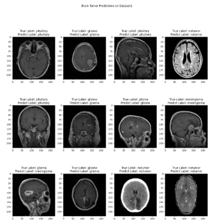

# Brain Tumor Detection in MRI Images using Transfer Learning

Deep-learning classification of brain tumors from MRI images.

**Project status:** Research report · 2024



Figure retained from the earlier portfolio.

**Authors:** Bhanu Prakash Vangala

## Available materials

- [Project report](https://drive.google.com/file/d/1upCswGveonJPN2vmuXzKlhbKqE8tkGSA/view?usp=sharing)
- [Academic portfolio](https://bhanuprakashvangala.github.io/)

## Runnable companion example

Evaluate supplied classification predictions and check split separation. Set group to the patient identifier and language to a fixed value such as und. No patient images or trained diagnostic model are included.

Requires Python 3.10+; no third-party packages. Run from the repository root:

```sh
python examples/evaluate.py examples/data/predictions.csv
```

[Source](../../examples/evaluate.py) · [Tests](../../tests/test_examples.py) · [Input formats](../../examples/README.md)

## Scope and provenance

The companion code was newly written for this portfolio in September 2026. It is a minimal reference example, not a recovered historical implementation. The example data are synthetic, and their output is not a research result.
