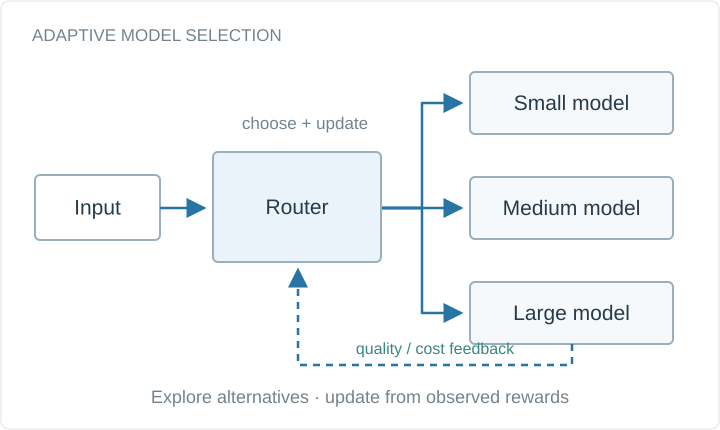

# FlexiFlow: Bandit-based Model Switching in ML Workflows

Runtime model selection for multi-step machine-learning pipelines, using bandit strategies to balance quality and execution cost.

**Project status:** Research project



Conceptual system diagram, drawn for this portfolio.

## Available materials

- Project overview and conceptual diagram in this directory.
- [Academic portfolio](https://bhanuprakashvangala.github.io/)

## Runnable companion example

[Standalone example repository](https://github.com/bhanuprakashvangala/adaptive-routing-examples)

Run a UCB1 model-selection simulation with synthetic rewards. This example illustrates adaptive selection; it is not the research implementation or an experiment from the paper.

Requires Python 3.10+; no third-party packages. Run from the repository root:

```sh
python examples/routing.py --rounds 1000 --seed 7
```

[Source](../../examples/routing.py) · [Tests](../../tests/test_examples.py) · [Input formats](../../examples/README.md)

## Scope and provenance

The companion code was newly written for this portfolio in September 2026. It is a minimal reference example, not a recovered historical implementation. The example data are synthetic, and their output is not a research result.
