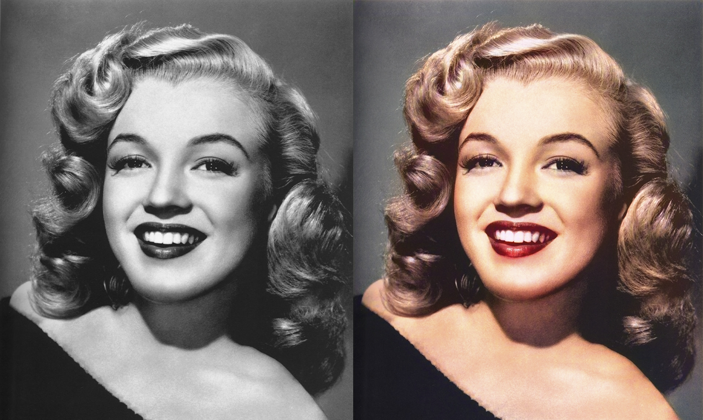

# Image Colorization using AI

Deep learning for adding color to grayscale photographs using convolutional autoencoders and generative adversarial networks.

**Project status:** IJARESM · 2022

Figure retained from the earlier portfolio.

**Authors:** Bhanu Prakash Vangala, Abdul Mannan Khan, Sagar Sujith Somepalli, Rakesh Chigurupati, Pratham Shah, Shubham Nandlal Vishwakarma

## Available materials

- [Paper / project](https://drive.google.com/file/d/14GH6eNzC28uhcN1Y-E3iZJ9a5G8mdXLz/view?usp=sharing)
- [Publication](https://www.researchgate.net/publication/376451637_Image_Colorization_using_AI)
- [Academic portfolio](https://bhanuprakashvangala.github.io/)

## Scope and provenance

This is a documentation artifact. The original implementation, trained weights, and datasets are not included here. The linked report or project description is the reference for the original work.
