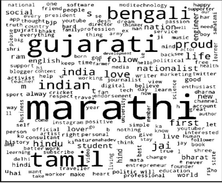

# Multilingual Sentiment Analysis on KOO User Posts

Sentiment analysis of multilingual social-media posts on KOO. B.Tech thesis with Prof. Ponnurangam Kumaraguru and Dr. Soubhagya Barpanda.

**Project status:** B.Tech thesis · 2023



Figure retained from the earlier portfolio.

## Available materials

- [Thesis](https://drive.google.com/file/d/1a2Xan4sDdC7ib7Hj5HODcjPyztmTee4k/view?usp=sharing)
- [Academic portfolio](https://bhanuprakashvangala.github.io/)

## Runnable companion example

Compute per-language accuracy, macro-F1, and confusion matrices from supplied predictions. Reject duplicate sample IDs and groups crossing dataset splits. This is an evaluation utility, not the original KOO model or dataset.

Requires Python 3.10+; no third-party packages. Run from the repository root:

```sh
python examples/evaluate.py examples/data/predictions.csv
```

[Source](../../examples/evaluate.py) · [Tests](../../tests/test_examples.py) · [Input formats](../../examples/README.md)

## Scope and provenance

The companion code was newly written for this portfolio in September 2026. It is a minimal reference example, not a recovered historical implementation. The example data are synthetic, and their output is not a research result.
