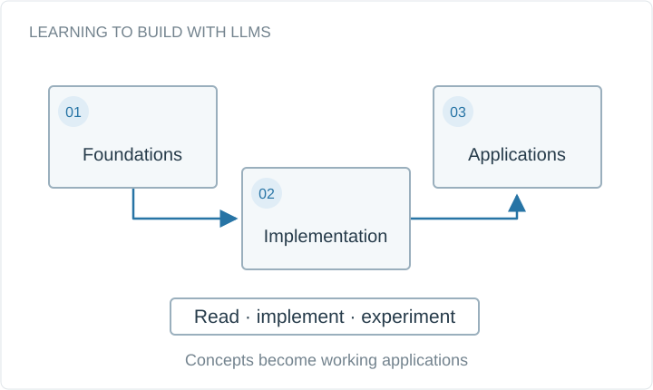

# LearnLLM.dev

An educational platform for learning to build with large language models, from core concepts to practical applications. Built and maintained with Next.js, TypeScript, and Supabase.

**Project status:** Live

Conceptual system diagram, drawn for this portfolio.

## Available materials

- [learnllm.dev](https://learnllm.dev)
- [Academic portfolio](https://bhanuprakashvangala.github.io/)

## Scope and provenance

This is a documentation artifact. The original implementation, trained weights, and datasets are not included here. The linked report or project description is the reference for the original work.
