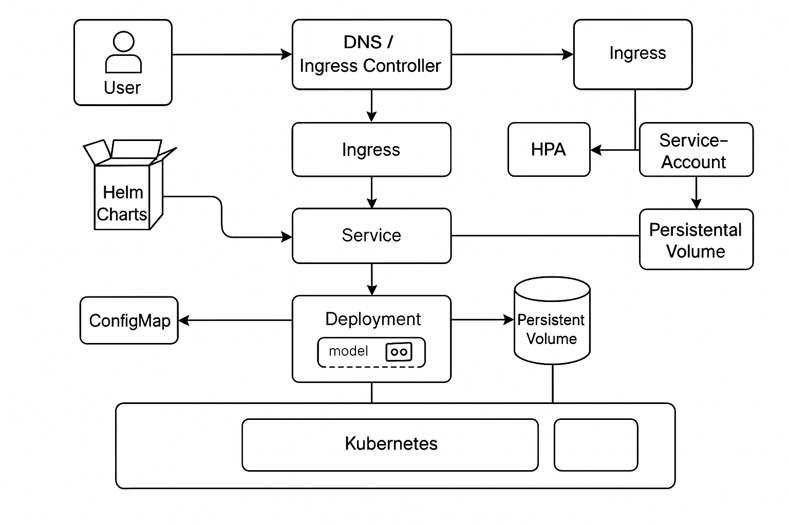

# Deploying LLMs as a Service in Kubernetes HPC Clusters

LLM inference infrastructure on a Kubernetes HPC cluster. M.S. thesis advised by Prof. Grant J. Scott and Prof. Jianlin Cheng.

**Project status:** M.S. thesis · 2025

Figure retained from the earlier portfolio.

## Available materials

- [Original public repository](https://github.com/bhanuprakashvangala/LLM-as-a-Service) — source code and setup instructions.
- [Thesis](https://drive.google.com/file/d/1XpQzEPGFAayWVz51zdXsPldg0CrV_DdQ/view?usp=sharing)
- [Academic portfolio](https://bhanuprakashvangala.github.io/)

## Scope and provenance

The linked project repository is the source of implementation details. This artifact is a navigable overview; its conceptual diagram is not a screenshot or a benchmark result.
