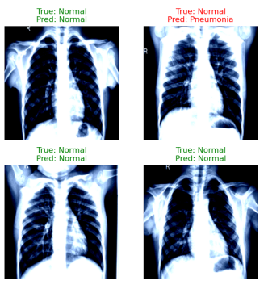

# Pneumonia Detection on X-ray Images Using Deep Learning

Deep-learning models for pneumonia classification from chest X-rays.

**Project status:** Preprint · 2025



Figure retained from the earlier portfolio.

**Authors:** Bhanu Prakash Vangala, Govardhan Khadakkar

## Available materials

- [Preprint](https://www.researchgate.net/publication/387956500_Pneumonia_Detection_on_X-ray_Images_Using_Deep_Learning)
- [Academic portfolio](https://bhanuprakashvangala.github.io/)

## Runnable companion example

Evaluate supplied classification predictions and check split separation. Use patient-level group identifiers. No patient images or trained diagnostic model are included.

Requires Python 3.10+; no third-party packages. Run from the repository root:

```sh
python examples/evaluate.py examples/data/predictions.csv
```

[Source](../../examples/evaluate.py) · [Tests](../../tests/test_examples.py) · [Input formats](../../examples/README.md)

## Scope and provenance

The companion code was newly written for this portfolio in September 2026. It is a minimal reference example, not a recovered historical implementation. The example data are synthetic, and their output is not a research result.
