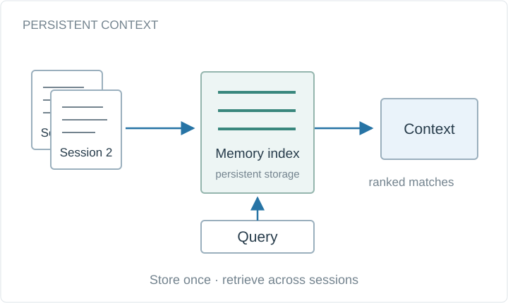

# ReflectMemory: persistent memory for long-context reasoning

A prototype for persisting and retrieving relevant context across long-running agent sessions.

**Project status:** Prototype



Conceptual system diagram, drawn for this portfolio.

## Available materials

- Project overview and conceptual diagram in this directory.
- [Academic portfolio](https://bhanuprakashvangala.github.io/)

## Runnable companion example

[Standalone example repository](https://github.com/bhanuprakashvangala/reflectmemory)

Persist user-supplied notes in SQLite FTS5 and retrieve relevant text. This small lexical baseline does not implement embedding retrieval or reproduce results from the earlier prototype.

Requires Python 3.10+; no third-party packages. Run from the repository root:

```sh
python examples/memory.py notes.db add "Kubernetes deployment notes"
python examples/memory.py notes.db search "deployment"
```

[Source](../../examples/memory.py) · [Tests](../../tests/test_examples.py) · [Input formats](../../examples/README.md)

## Scope and provenance

The companion code was newly written for this portfolio in September 2026. It is a minimal reference example, not a recovered historical implementation. The example data are synthetic, and their output is not a research result.
