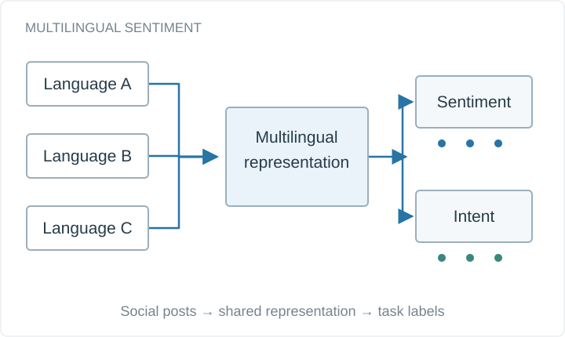

# SocialSift: crisis-aware multilingual sentiment analysis

Transformer-based sentiment and intent analysis over multilingual social media during natural disasters.

**Project status:** Completed

Conceptual system diagram, drawn for this portfolio.

## Available materials

- [Original public repository](https://github.com/bhanuprakashvangala/SocialSift) — source code and setup instructions.
- [Academic portfolio](https://bhanuprakashvangala.github.io/)

## Scope and provenance

The linked project repository is the source of implementation details. This artifact is a navigable overview; its conceptual diagram is not a screenshot or a benchmark result.
