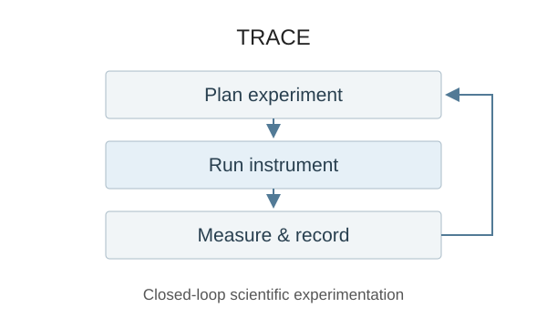

# TRACE: A Programmable Cloud Laboratory for Autonomous Experimentation

Closed-loop experimentation across scientific instruments, connecting experiment planning, execution, measurements, and provenance.

**Project status:** Research project

Conceptual system diagram, drawn for this portfolio.

## Available materials

- Project overview and conceptual diagram in this directory.
- [Academic portfolio](https://bhanuprakashvangala.github.io/)

## Scope and provenance

This is a documentation artifact. The original implementation, trained weights, and datasets are not included here. The linked report or project description is the reference for the original work.
