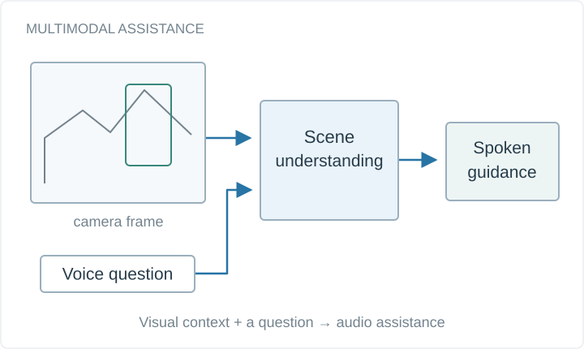

# VisionAI: AI assistance for visually impaired users

Fine-tuned multimodal LLMs for hazard detection and accessibility from a live camera feed. Runner-up at the IBM / MUIDSI Generative AI for Social Good Hackathon 2025.

**Project status:** Runner-up, $1,000

Conceptual system diagram, drawn for this portfolio.

## Available materials

- [Original public repository](https://github.com/bhanuprakashvangala/VisionAI) — source code and setup instructions.
- [Academic portfolio](https://bhanuprakashvangala.github.io/)

## Scope and provenance

The linked project repository is the source of implementation details. This artifact is a navigable overview; its conceptual diagram is not a screenshot or a benchmark result.
